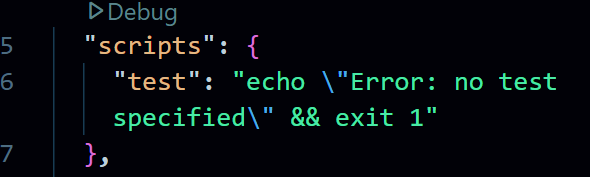
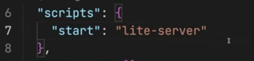

# Adv. Typescript

<hr>

#### Project setup.

1. run the following cmd. this will generate **config.ts** file.

```
tsc --init
```

2. Now we have to create a project so.

```
npm init -y
```

this will generate **package.json file** and `-y` is that it will not ask Questions. this file is for installing other packages.

3. Create a new file **index.html**.
   Now, here we need to load our script tag and` src=""`.
   But there is no any file.

4. Create two folders, **src** and **dist**.
   this below cmd is for windows.
   For mac or linux run `mkdir src dist`.

```
mkdir src, dist
```

<hr>

**IMP NOTE -**
The `src` folder contains the original source code of your project.

This is where you write uncompiled code (e.g., TypeScript, SCSS, JSX, or ES6 JavaScript).

The `dist` folder contains the final compiled version of your code.

It is generated automatically when you build your project (e.g., with Webpack, Vite, or Angular CLI).

This folder contains **optimized** and **minified** files ready for deployment.

This folder structure may seem like -

```bash
/dist
  ├── bundle.js
  ├── styles.css
  ├── index.html
```

#### Why Do We Separate src and dist?

✅ Keeps the project clean. you only edit src, and dist is auto-generated.

✅ Faster deployments. you only upload dist to production.

✅ Improves performance. minified/optimized code in dist.

✅ Works with build tools. Webpack, Babel, and TypeScript output to dist.

<hr>

5. Create a file inside src. `index.ts`.
   where we will write Ts code.

6. But we also have to load script tag in **index.html**. and we know that at the end, **Ts** is get converted into **Js**.

7. Here, we can create index.js file manually inside dist folder or it will get autogenerate when index.ts file get compiled. Right????

_But who is going to tell that generate js file **inside the dist folder**._
----> **tsconfig.json**.

If you dont create manually, write some code in src/index.ts and run the cmd `tsc -w`. But first config the _tsconfig.json as shown below. so that the compiled file will generate in **dist** folder_.

Here we create manually & load script tag with `src="./dist/index.js"` in **index.html**.

8. Go to **tsconfig.json**, 62 line no. comment in the `outDir` and give folder `dist`.

```json
"outDir": "./dist" /* Specify an output folder for all emitted files. */,
```

It will actually scan whole code base and whenever there is compilation, the compiled ones will store in `dist` folder.

9. Lets check it.Run the following cmd

```
tsc -w
```

**Watch mode ON.**
_This will watch our code simultanously and compiled it as well._

So, when i change index.ts file and save it. changes get reflect in **index.js** inside _dist_ folder.

<hr>

#### How to start it on server.

Now, we know that to start a server, we need **index.html** which we have.

There are two ways to do this.

1. Go to index.html > Right click > Open with live server. (_Make sure your script tag is loaded._)

2. Install Package name **lite server**.

a. Run the following cmd.

```bash
npm i lite-server
```

b. Create scripts. Go to **package.json**.
_remove the test script_


_Add the following script._


c. Now run following cmd.

```bash
npm start
```

this will start our live local host server.

<hr>

#### Here, we use our Live server. (1st way)

#### IMP Note : **Make sure you have watch mode ON as well. So that Ts will compiled whenever there will be changes.**

<hr>

2:53.
