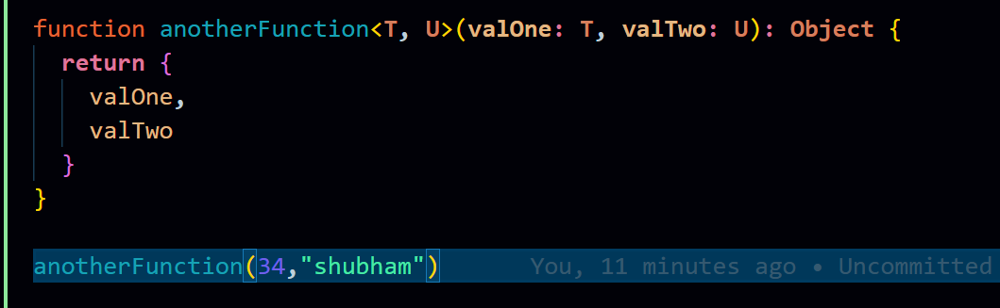
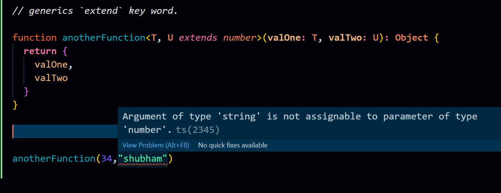

# Adv. Typescript

<hr>

#### Project setup.

1. run the following cmd. this will generate **config.ts** file.

```
tsc --init
```

2. Now we have to create a project so.

```
npm init -y
```

this will generate **package.json file** and `-y` is that it will not ask Questions. this file is for installing other packages.

3. Create a new file **index.html**.
   Now, here we need to load our script tag and` src=""`.
   But there is no any file.

4. Create two folders, **src** and **dist**.
   this below cmd is for windows.
   For mac or linux run `mkdir src dist`.

```
mkdir src, dist
```

<hr>

**IMP NOTE -**
The `src` folder contains the original source code of your project.

This is where you write uncompiled code (e.g., TypeScript, SCSS, JSX, or ES6 JavaScript).

The `dist` folder contains the final compiled version of your code.

It is generated automatically when you build your project (e.g., with Webpack, Vite, or Angular CLI).

This folder contains **optimized** and **minified** files ready for deployment.

This folder structure may seem like -

```bash
/dist
  ├── bundle.js
  ├── styles.css
  ├── index.html
```

#### Why Do We Separate src and dist?

✅ Keeps the project clean. you only edit src, and dist is auto-generated.

✅ Faster deployments. you only upload dist to production.

✅ Improves performance. minified/optimized code in dist.

✅ Works with build tools. Webpack, Babel, and TypeScript output to dist.

<hr>

5. Create a file inside src. `index.ts`.
   where we will write Ts code.

6. But we also have to load script tag in **index.html**. and we know that at the end, **Ts** is get converted into **Js**.

7. Here, we can create index.js file manually inside dist folder or it will get autogenerate when index.ts file get compiled. Right????

_But who is going to tell that generate js file **inside the dist folder**._
----> **tsconfig.json**.

If you dont create manually, write some code in src/index.ts and run the cmd `tsc -w`. But first config the _tsconfig.json as shown below. so that the compiled file will generate in **dist** folder_.

Here we create manually & load script tag with `src="./dist/index.js"` in **index.html**.

8. Go to **tsconfig.json**, 62 line no. comment in the `outDir` and give folder `dist`.

```json
"outDir": "./dist" /* Specify an output folder for all emitted files. */,
```

It will actually scan whole code base and whenever there is compilation, the compiled ones will store in `dist` folder.

9. Lets check it.Run the following cmd

```
tsc -w
```

**Watch mode ON.**
_This will watch our code simultanously and compiled it as well._

So, when i change index.ts file and save it. changes get reflect in **index.js** inside _dist_ folder.

<hr>

#### How to start it on server.

Now, we know that to start a server, we need **index.html** which we have.

There are two ways to do this.

1. Go to index.html > Right click > Open with live server. (_Make sure your script tag is loaded._)

2. Install Package name **lite server**.

a. Run the following cmd.

```bash
npm i lite-server
```

b. Create scripts. Go to **package.json**.
_remove the test script_


_Add the following script._


c. Now run following cmd.

```bash
npm start
```

this will start live local host server.

<hr>

#### Here, we use our Live server. (1st way)

#### IMP Note : **Make sure you have watch mode ON as well. So that Ts will compiled whenever there will be changes.**

<hr>

### Classes in Ts.

_In Ts, we first have to define the parameters and their types before writing constructor._

```typescript
class User {
  // In Ts, we first have to define the parameters and their types before writing constructor.
  email: string;
  code: number;
  city: string = "Pune";
  constructor(email: string, code: number) {
    this.email = email;
    this.code = code;
  }
}

let shubham = new User("shubham@gmail.com", 292929);

shubham.city = "New york";
```

**From above code, `city` variable needs a initializer because we dont add it to constructor.**

_I can even apply `readonly` property to those variable._

For **city** variable, there we cannot reassign but it is accessible there.
But if we dont want to accessible, we can use `private` keyword.

_see the code below._

```typescript
class User {
  // here we use private keyword
  email: string;
  code: number;
  private city: string = "Pune";
  constructor(email: string, code: number) {
    this.email = email;
    this.code = code;
  }
}

let shubham = new User("shubham@gmail.com", 292929);

shubham.city; // Throws error here. because we can access here. we can only access in class "User".
```

#### Access modifiers. private, public and protected.

**This `access modifiers` are actually limit our accessibility towards properties.**

There is another modifier "public" which actually does opposite of "private".
**If we dont mention any othem, the variable is in public mode by default.**

**In javacsript world, it actually `#` which used to act as private.**

```javascript
class Person {
  #name; // Private field

  constructor(name) {
    this.#name = name;
  }

  getName() {
    return this.#name; // Accessing private field inside the class
  }
}

const person = new Person("Swayam");
console.log(person.getName()); // ✅ Works: Outputs "Swayam"

console.log(person.#name); // ❌ Error: Private field cannot be accessed outside the class
```

<hr>

#### protected access modifier.

This is where inheritance also comes in action.


```typescript
class Car {
  constructor(protected model: string, price: number) {} // ------- protected keyword is used.

  get price(): number {
    return this.price;
  }

  set price(value) {
    this.price = value;
  }
}

const myCar = new Car("Benz", 309999);

console.log(myCar.price);

myCar.price = 490000;
console.log(myCar.price, "Updated value");

class subCar extends Car {
  carInsurance: boolean = true;
  anyFun() {
    this.model = "Mercedez";
  }
}
```

Here, **protected** keyword actually allow properties to access within it own class or its **child** or **inherited** class.

#### Getter & setter in Ts.

It comes when we have to customize the accessiblity of any values. sometimes, if anyone ask _(console logging)_ for password, we dont want but actaully give it modifying or encrypted. this is when our **getter** and **setter** comes in action.

whenever we create any properties in class, get and set method automatically get assign to them.So we can apply set and get methods to any properties in class.

_remind the `prototype` object we get and there are methods._

**we can apply getter and setter to any variable there in class.**

**Here how we use them in Javascript.**

```javascript
class User {
  constructor(email, password) {
    this.email = email;
    this._password = password; // Using _password to avoid recursion & ✅ Original password is stored here
  }

  get password() {
    return `Encrypted: ${this._password}`;
  }

  set password(value) {
    console.log(`Setting new password: ${value}`);
    this._password = value; // Assigning the new value to _password
  }
}

const user = new User("test@example.com", "12345");

console.log(user.password); // Calls getter → Encrypted: 12345

user.password = "67890"; // Calls setter with value "67890"
console.log(user.password); // Encrypted: 67890
```

For Revision : https://youtu.be/t6vLhF-iSxQ?si=YQKwpK47wbv-Zkse

**Getter and setter are used in classes. A getter is defined with the same name as the property and the get keyword. It does not take parameters because it only returns a modified version of the value, preventing direct access to the original one.**

**A setter is used for updating the property value. It requires exactly one parameter, which represents the new value. The setter is automatically called when we assign a new value to the property, updating it without returning anything.**


<hr>

#### Now, setter and getter in Ts.

In Ts, we first **have to** declared properties before using them.

```typescript
private _price: number;
model: string;
```

Then constructor comes in action.

```typescript
constructor(model: string, price: number) {
    this.model = model;
    this._price = price;
}
```

✅ Fixed & Complete TypeScript Code.

```typescript
class Car {
  model: string;
  private _price: number;

  constructor(model: string, price: number) {
    this.model = model;
    this._price = price;
  }

  get price(): number {
    return this._price;
  }

  set price(value: number) {
    if (value < 0) {
      throw new Error("Price cannot be negative");
    }
    this._price = value;
  }
}

const myCar = new Car("Benz", 309999);

console.log(myCar.price); // Calls getter → 309999

myCar.price = 490000; // Calls setter
console.log(myCar.price, "Updated value"); // 490000 Updated value
```

**Remember:** In typescript setter method should not give any return type as it does not return anything.😂🤣

This below image when I assign -ve number to `price` property.


**setter and getter are actually used to deal with private properties and have additional logic to it.**

<hr>

#### Interface in classes.

here, we actually used in classes. just see below.

It focus on when we create interface, and attach it to a class. **How it actually works ?**

**3:19 ---- Timestamp to comeback and revise it.**

```typescript
interface takePhoto {
  cameraMode: string;
  filter: string;
  burst: number;
}

interface Story {
  isPhoto: boolean;
  createStory(): number;
}

class Instagram implements takePhoto {
  constructor(
    public cameraMode: string,
    public filter: string,
    public burst: number
  ) {}
}

class Youtube implements takePhoto, Story {
  constructor(
    public cameraMode: string,
    public filter: string,
    public burst: number,
    public isPhoto: boolean,
    public liveStream: string // added new one
  ) {}

  createStory(): number {
    return 404;
  }
}
```

_While doing this, we actually have to follow properties and should implement them in class. otherwise it throws an error._

When to Use Interfaces?

✔ When multiple classes share a common structure.

✔ When enforcing strict type-checking in APIs or services.

✔ When implementing multiple behaviors in a single class.

✔ When writing scalable and maintainable code.

<hr>

#### Abstract Classes.

It is actually a class from which we cannot create any object. but we can create a object from class which inherits the abstract class.

_See the below code._

```typescript
abstract class TakePhoto {
  constructor(
    public cameraMode: string,
    public burst: string,
    public panamoraMode: boolean
  ) {}
}

class Instagram extends TakePhoto {}

const shubham = new Instagram("phot2", "sgs", true);

export {};
```

An abstract class in TypeScript is like a blueprint for other classes. You cannot create an object from an abstract class. **It only defines methods and properties that child classes must implement**.

👉 Think of it like a template that enforces rules on child classes.

```typescript
//  This cannot be used to create an object directly.
// Acts as a blueprint for car-related classes.
abstract class CarFactory {
  // 2️⃣ Constructor (Common Properties for All Cars)
  // Every car will have a name and a model.
  // These values are set when a child class (like BMW) is created.
  constructor(public carName: string, public model: string) {}

  // 3️⃣ Regular (Concrete) Methods
  // ✅ These methods are already implemented, so child classes can use them directly.
  // ✅ No need for child classes to override these unless they want different behavior.
  start(carName: string): string {
    return `${carName} has started..`;
  }

  stop(carName: string): string {
    return `${carName} is stopped..`;
  }

  // 4️⃣ Abstract Methods (Must Be Implemented by Child Classes)
  // ❌ These methods are not implemented inside CarFactory.
  // ✅ Child classes must provide their own implementations.
  abstract carSpeed(speed: number): string;
  abstract carMileage(distance: number): string;
}

// 5️⃣ Child Class (BMW) - Extending CarFactory
// BMW inherits from CarFactory, so it gets:
// ✅ The start() and stop() methods (already implemented).
// ❌ But it must implement carSpeed() and carMileage().
class BMW extends CarFactory {
  // 6️⃣ Implementing the Abstract Methods in BMW
  // Since every car has a different speed and mileage, BMW provides its own implementation.
  carSpeed(speed: number): string {
    return `${speed}km/hr.`;
  }

  carMileage(distance: number): string {
    return `${distance}/ltr`;
  }
}

// 7️⃣ Creating an Object of BMW
const myCar = new BMW("BMW-Marcy", "x10");
console.log(myCar.start(myCar.carName)); // ✅ Uses inherited method
console.log(myCar.carSpeed(250)); // ✅ Uses overridden method
console.log(myCar.carMileage(15)); // ✅ Uses overridden method
```

#### Key Takeaways

✅ Abstract classes enforce structure but can't be instantiated.

✅ Child classes must implement abstract methods while inheriting normal methods.

✅ Useful when multiple classes share common methods but have their own variations for some.

💡 You can now create more child classes like Tesla, Audi, etc., and they will have their own speed and mileage!

<hr>

#### Now super in abstract classes.

In TypeScript, super is used to call the constructor or methods of a parent class from a derived (child) class. It is mainly used in class inheritance when working with extends.

##### 🔹 Using super in the Constructor

**When a class extends another class, you must call super() inside the constructor of the child class before accessing `this`.**

```typescript
class Parent {
  name: string;

  constructor(name: string) {
    this.name = name;
  }
}

class Child extends Parent {
  age: number;

  constructor(name: string, age: number) {
    super(name); // Calls the Parent's constructor
    this.age = age;
  }
}

const child = new Child("Swayam", 20);
console.log(child.name); // Output: Swayam
console.log(child.age); // Output: 20
```

**But Why we have to call parent contructor ???**

Because, when there is parent and a child class, all the properties and methds of parent class inherited to child class. but to access them we need to call parent class constructor using super(_any property of parent class_).

**super() Ensures the Parent is Initialized**

🔑 Key Takeaways

✔ Always call super() first in a child class before using this.

✔ It ensures that the parent’s constructor runs before the child’s properties are initialized.

✔ If you don’t define a constructor in the child class, TypeScript calls the parent’s constructor automatically.

✔ No super() is needed if the class does not extend another class.

<hr>

#### Generics in Ts.

It is actually used when we have to take same **type** of argument and return same **type** of value.

```typescript
const score: Array<number> = []; // this is another way to create a array.

const names: Array<string> = [];
```

```typescript
function identityOne(val: number | string): number | string {
  return val;
}
```

_From above, How Or we are going to need ????._

```typescript
function identityTwo(val: any): any {
  return val;
}
```

_Here, actually we can take argument any type and return any..._

```typescript
function identityThree<Type>(val: Type): Type {
  return val;
}
```

_This is how we actually used generics in Ts. It is going to take arg of any type and return that type of value._

**We can actually create our own type and use generic. the below is code.**

```typescript
//   Here we actually created our own type.
interface Laptop {
  brand: string;
  price: number;
}

// Generic function
function identityFour<T>(obj: T): T {
  return obj;
}

// Calling the function with Laptop type
identityFour<Laptop>({ brand: "HP", price: 120000 });
```

IMP : **Here, we got generic function because it taking arg of `T` type and return same type. while calling function we use `<Laptop>`. we actually tellling typescript that 👉 For this call, treat T as the Laptop interface.**

**Now, T is fixed as Laptop, so TypeScript expects an object of this type.**

**Because the function’s return type is T, and we set T = Laptop,
TypeScript understands that the returned value is of type Laptop.**

**Another great example.**

```typescript
interface Laptop {
  brand: string;
  version: string;
}

function getLaptop<T>(obj: T): T {
  return obj;
}

const laptopDetails: Laptop = getLaptop<Laptop>({
  brand: "Lenovo",
  version: "victus x18",
});

console.log(laptopDetails.brand);
console.log(laptopDetails.version);
```

#### Generics with array and Arrow function.

```typescript
function getProduct<T>(product: T[]): T {
  // do some database operations
  return product[2];
}
```

```typescript
const getMorePrducts = <T>(product: T[]): T => {
  const myIndex = 4;
  return product[myIndex];
};
```

<hr>

### But in most codebase, you are going to see `< T >` like this `< T , >`. Yes this "," not different but just for indicating that the function is generic not regular function.

<hr>


Its not giving error but when i use `extend` using in line **<T, U>**, it will give me error.



Now, if we create a interface `Database`, here how we have to do it.

```typescript
interface Database {
  name: string;
  password: number;
}

// here, U is extend to interface Database
function anotherFunction<T, U extends Database>(valOne: T, valTwo: U): Object {
  return {
    valOne,
    valTwo,
  };
}

anotherFunction(34, { username: "shubham29", password: 1234 });
```

<hr>

#### Norrowing in Ts.

**It is actually very easy but do go on documentation and read.**

_Below is hitesh's example._

```typescript
const arr = [1, 2, 3];

console.log(typeof arr); // Output: "object"
```

it becames tricky now. **Always remember, Js and Ts treat Array as Object.**

<hr>

#### `in` operator in narrowing.

```typescript
// `in` operator in narrowing

interface User {
  name: string;
  email: string;
}

interface Admin {
  name: string;
  email: string;
  isAdmin: boolean;
}

function isAdmin(account: User | Admin) {
  if ("isAdmin" in account) {
    return account.isAdmin;
  }
  return account.name;
}
```

#### Norrowing using predicates.

```typescript
// Norrowing Using type predicates

type Fish = {
  swim: () => void;
};

type Bird = {
  fly: () => void;
};

function isFish(pet: Fish | Bird): pet is Fish {
  return (pet as Fish).swim !== undefined;
}

function getFood(pet: Fish | Bird) {
  if (isFish(pet)) {
    pet;
    console.log("Fish food");
  } else {
    pet;
    console.log("Bird food");
  }
}
```

<hr>

#### Narrowing with discriminated unions.

```typescript
// discriminated unions

interface Circle {
  kind: "circle";
  radius: number;
}

interface Square {
  kind: "square";
  side: number;
}

type Shape = Circle | Square;

function getTrueShape(shape: Circle | Square) {
  if (shape.kind === "circle") {
    return (shape.radius * 21) / 7;
  }
  return shape.side * 4;
}
```
